# Задание
Реализуйте и сравните 3-5 различных алгоритмов поиска подстроки в строке. Для каждого найдите условия, где он работает лучше всего.

# Описание программы
Пункты:
1. Краткое описание логики
2. Алгоритмы:
    * Использованные структуры данных
    * Оценка сложности 
    * Оценка использования памяти
3. Функция для генерации данных и их сохранения
4. Анализ данных в Jupiter Notebook
5. Результаты анализа

## Краткое описание логики
### app.py - основная программа:
1. После поступления необходимых параметров в командную строку, создается новая папка с помощь функции createFolder и выполняется функция runapp() с параметрами folder, text, substring соответственно.
2. Считывается текст из файла, путь которого был указан в переменной text
3. Считывается подстрока из файла, путь которого был указан в переменной substring
4. Последовательно выполняются алгоритмы поиска подстроки в строке и сохраняются в переменные
5. Далее открывается файл result.txt и в него записываются результаты алгоритмов поиска подстроки в строке.

### substrings - дополнительно:
1. При запуске скрипта выполняется обычный тест на корректность выполнения функций
2. Выполняется функция, которая записывает результаты в csv таблицу для дальнейшего анализа


    Подробнее в 3 пункте.

## Алгоритмы:
* Алгоритм Кнута-Морриса-Пратта
* Мое решение (modDirectSearch)
* Алгоритм Бойера — Мура — Хорспула
* Алгоритм Рабина-Карпа
* Автоматный алгоритм алгоритм Ахо-Корасик

### Алгоритм Кнута-Морриса-Пратта
Этапы работы КМП можно разбить на 2 части:
* формирование массива help_list, используемого при сдвиге образа вдоль строки
* поиск образа в строке

#### Псевдокод префикс функции:
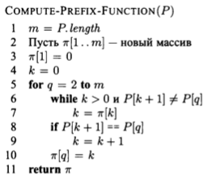

#### Алгоритм работы префикс функции:
1. Создается вспомогательный массив help_list, у которого первый элемент равен 0
2. Итерируемся по подстроке (образу) и заполняем массив по правилу, которое можно сформулировать так:
     * Префикс-функция для i символа образа возвращает значение, равное масксимальной длине совпадающих префикса и суффикса подстроки в образе, которая заканчивается i символом. Это значение сохраняется в help_list.    

#### Псевдокод основной функции:
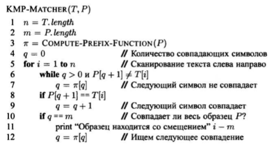

#### Алгоритм работы основной функции:
1. Итерируемся по тексту
    * Если буквы у паттерна и из текста совпали, то сдвигаем итератор на следующий элемент и проверяем если мы дошли до конца подстроки, то возвращаем значение итератора, который сдвинули назад на длину паттерна (подстроки).
    * Если совпадений не было и char_l(итератор подстроки) равен 0, то в случае когда char_k(итератор по тексту) дошел до конца, то возвращаем -1
    * Иначе: итератору подстроки присваивается значение help_list[char_l - 1] из вспомогательного массива help_list.
2. Выход из цикла и возвращаем значение -1 или char_k - len_sub

#### Реализация функций:
```python
def kmp(text, sub):
    if text == "" or sub == "":
        return -1

    len_text = len(text)
    len_sub = len(sub)

    help_list = [0] * len_sub
    help_list[0] = 0
    char_j = 0

    # O(p)
    for char_i in range(1, len_sub):
        if (sub[char_i] == sub[char_j]):
            help_list[char_i] = char_j + 1
            char_i += 1
            char_j += 1
        elif (char_j == 0):
            help_list[char_i] = 0
            char_i += 1
        else:
            char_j = help_list[char_j - 1]

    # O(t)
    char_l = 0
    for char_k in range(len_text):
        if text[char_k] == sub[char_l]:
            char_k += 1
            char_l += 1
            if char_l == len_sub:
                return char_k - len_sub
        else:
            if (char_l == 0):
                char_k += 1
                if char_k == len_text:
                    return -1
            else:
                char_l = help_list[char_l - 1]

    return -1
```

#### Сложность:
* |Σ|=σ - размер алфавита
* |text|=t — длина текста
* |pattern|=p — длина паттерна

**Препроцессинг:** O(p)

Префикс-функция может быть вычеслена (амортизационно) за О(p) сравнений перед началом поиска.
А поскольку текст будет пройден только один раз, то суммарное время работы алгоритма будет O(p + t).

**Худшее:** O(p + t)

**Среднее:** O(p + t)

Для префикс-функции необходимо объявить массив длины p, поэтому и расход памяти будет О(p).

**Дополнительная память:** O(p)

### Алгоритм Бойера — Мура — Хорспула

Эффективность алгоритма БМХ обусловлена тем, что удается пропускать те части текста, которые заведомо не участвуют в успешном сопоставлении.

#### Этапы работы алгоритма:
1. формирование таблицы (словаря) d, используемой при сдвиге образа по строке
2. поиск образа в строке

       Сравнение символов начинается с конца образа, а не с начала. 

#### Этап 1: составление таблицы (словаря) d
##### **Правила:**
1. Если символ встречается более одного раза, то приминяем значение, соответствующее символу, наиболее близкому к концу образа.
2. Неоднократное вхождение символов в образ никак не влияет на вычисление удаленности других символов от конца образа.
3. Если символ в конце образа встречается только один раз, то соответствующее ему значение таблицы (словаря) d равно длине образа.
4. Если символ в конце образа встречается более 1 раза, то приминяем значение, соответствующее символу, наиболее близкому к концу образа.
5. Для символов, не присутствующих в образе, будем применять значение, равное длине образа.
    

Образ | d
---| ---
данные* | 5422166
д**е**нны**е** | 5**4**221**4**

#### Этап 2: поиск подстроки
##### **Пример 1**

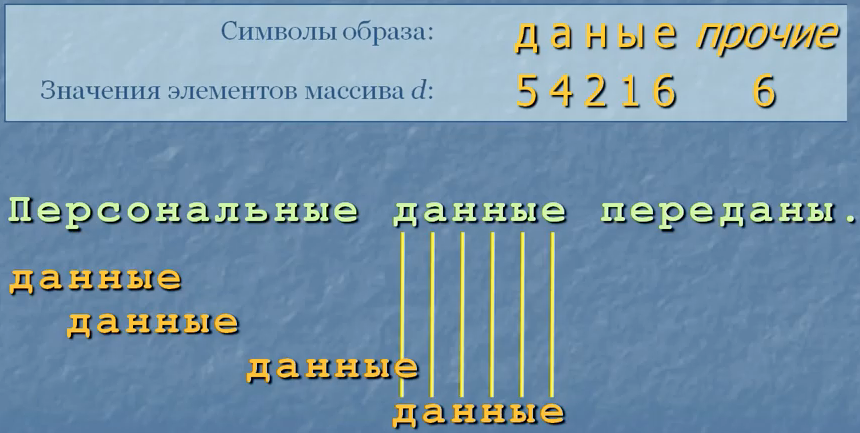

##### **Правила:**
1. При сравнении строки и образа, в случае несовпадения символов, образ сдвигается вдоль строки слева направо.
2. По самому же образу проходим справа налево.
3. При несовпадении символов смещение определяется значением таблицы d, соответствующим символу строки*, а не образа.
     * Если уже был ряд совпадений символов строки и образа, и произошло несовпадение, то смещение определяется значением таблицы d, соответствующим последнему символу образа.

```python
def bmx(text, sub):
    if text == "" or sub == "":
        return -1

    len_text = len(text)
    len_sub = len(sub)

    d = {}
    for char_i in range(len_sub):
        if (char_i + 1 != len_sub):
            d[sub[char_i]] = len_sub - char_i - 1
        elif (sub[char_i] not in d and char_i + 1 == len_sub):
            d[sub[char_i]] = len_sub

    for char_i in range(len_sub - 1, len_text):
        if text[char_i] == sub[-1]:
            sum = 1
            char_tx = char_i - 1
            for j in range(len_sub - 1)[::-1]:
                if text[char_tx] == sub[j]:
                    sum += 1
                    char_tx -= 1
                else:
                    if text[char_tx] in d:
                        char_i += d[text[char_tx]]
                    else:
                        char_i += len_sub
                    break

            if sum == len_sub:
                return char_i - len_sub + 1
        else:
            if text[char_i] in d:
                char_i += d[text[char_i]]
            else:
                char_i += len_sub

    return -1
```

#### Сложность:
* |Σ|=σ - размер алфавита
* |text|=t — длина текста
* |pattern|=p — длина паттерна

##### Достоинства:
1. Фаза предварительной обработки во времени O ( p + σ ) и сложности пространства O (σ)
2. Фаза поиска по O ( p t ) временной сложности
3. Фаза поиска имеет квадратичный наихудший случай, но среднее число сравнений для одного текстового символа составляет от 1 /σ до 2 / ( σ + 1).

##### Наихудший случай:
    Временная сложность: O(p * t)

##### Наилудший случай:
    Временная сложность: O(p / t)

##### Средний случай:
    Средняя временная сложность: O(m / σ)

##### Дополнительная память:
    О(m + σ).

### Мое решение (modDirectSearch)
Данный алгоритм - это модификация алгоритма КМП, вместо префикс функции используется сумма совпадающих букв подстроки с подтекстом, что позволяет при несовпадении сдвигать итератор на эту сумму + 1.

0. Итерируемся по массиву с текстом с помощью char_i
1. Если найдена первая буква подстроки, то начинаем подготовку для проверки оставшихся символов
2. Создадим 2 переменные sum_chars_substr - сумма совпадающих букв подстроки с подтекстом и next_char_i - следующий номер после char_i
3. Входим в цикл и начинаем итерироваться в подстроке
    * Если буквы совпали, то увеличиваем счетчик sum_chars_substr.
    * Если буквы не сопали, то выходим из цикла
4. После выхода из цикла подстроки выполняем проверку:
    * Если sum_chars_substr == len_sub, где len_sub - длина подстроки, то возвращаем char_i
    * Иначе: char_i = next_char_i + 1 - переходим к следующему элементу после next_char_i
5. Повтор 0 - 4 пока не дойдем до конца строки или не найдем подстроку
6. В случае если подстрока не была найдена, то возвращаем -1, иначе возвращаем char_i на 4 пункте.

```python
def modDirectSearch(text, sub) -> int:
    if text == "" or sub == "":
        return -1

    len_text = len(text)
    len_sub = len(sub)

    for char_i in range(len_text):
        if text[char_i] == sub[0]:
            sum_chars_substr = 1    # сумма совпадающих букв подстроки с подтекстом.

            next_char_i = char_i + 1

            for j in range(1, len_sub):
                if text[next_char_i] == sub[j]:
                    sum_chars_substr += 1
                else:
                    break

                next_char_i += 1

            if sum_chars_substr == len_sub:
                return char_i
            else:
                char_i = next_char_i + 1

    return -1
```

#### Сложность
* |text|=t — длина текста
* |pattern|=p — длина паттерна

В данной реализации отсутствует префикс-функция, а значит и время на препроцессинг тоже отсутствует.
В цикле мы обходим текст только один раз, но количество неполных обходов подстроки может быть не один раз, поэтому в лучшем случае сложность будет O(t) сравнений, а в среднем и в худшем - O(p + t).

**Лучшее:** O(t)

**Худшее:** O(p + t)

**Среднее:** O(p + t)

**Препроцессинг:** нет

**Дополнительная память:** O(1)

### Алгоритм Рабина-Карпа
#### Особенности
1. использует функцию хеширования;
2. фаза предварительной обработки в O ( p ) сложность времени и постоянное пространство;
3. фаза поиска по O ( p t ) временной сложности;
4. O ( p + t ) ожидаемое время работы.

#### Этапы работы алгоритма
1. Вычисляем хеш-функции от каждой строки S
2. Перебираем в цикле все подстроки T длины L
3. Для каждой такой подстроки вычиляем хеш-функцию
4. Сравниваем значение хеш-функции с значением хеш-функций всех строк S
5. Только если есть совпадение хеш-функций, то тогда сравниваем эту подстроку T с той строкой S, для которой было совпадение

```python
class Hash:
    def __init__(self, string, size):
        self.str  = string
        self.hash = 0
        for i in range(0, size):
            self.hash += ord(self.str[i])
        self.init = 0
        self.end  = size

    def update(self):
        if (self.end <= len(self.str) -1):
            self.hash -= ord(self.str[self.init])
            self.hash += ord(self.str[self.end])
            self.init += 1
            self.end  += 1

    def digest(self):
        return self.hash

    def text(self):
        return self.str[self.init:self.end]

def rabin_karp(text, sub):
    n = len(text)
    nsub = len(sub)
    htext = Hash(text, nsub)
    hsub = Hash(sub, nsub)
    hsub.update()
    for i in range(n - nsub + 1):
        if htext.digest() == hsub.digest():
            if htext.text() == sub:
                return i
        htext.update()
    return -1
```

#### Сложность
* |Σ|=σ - размер алфавита
* |text|=t — длина текста
* |pattern|=p — длина паттерна

Фаза предварительной обработки алгоритма Карпа-Рабина состоит в вычислении хэша ( x ). 
Это может быть сделано в постоянном пространстве и O ( p ) времени.

**Препроцессинг:** O(p)

    На этапе поиска достаточно сравнить хеш ( x ) с хешем ( y [ j .. j + m -1]) для 0 <= j < n - m. 
    Если равенство найдено, все равно необходимо проверять равенство x = y [ j .. j + m -1] символ за символом.

Временная сложность фазы поискового алгоритма Карпа-Рабина является O ( p t ).

    Худшее: O(p * t)

Ожидаемое количество сравнений текстовых символов O ( p + t ).

    Среднее: O(p + t)

**Дополнительная память:** O(1)

### Автоматный алгоритм Ахо-Корасик
#### Описание
Алгоритм Ахо-Корасик (АК) (Aho-Corasick algorithm) (AC) - классическое решение задачи точного сопоставления множеств.
    
    АК основан на структуре данных "дерево ключевых слов" (keyword tree).

Дерево ключевых слов (или "бор") (keyword tree, trie) для множества шаблонов P - это дерево с корнем K, такое что:
1. Каждое ребро e в K отмечено одним символом.
2. Всякие два ребра, исходящие из одной вершины, имеют разные метки. Определим метку вершины v как конкатенацию меток ребер, составляющих путь из корня в v, и обозначим ее L (v).
3. Для каждого шаблона Pi из множества P есть вершина v, такая что L (v) = Pi. 4. Метка каждой вершины-листа является шаблоном из множества P.


#### Построение автомата АК
##### **Этап 1**
1. Строим бор для словаря P.
При добавлении каждого слова Pi из P, вершине v с меткой Pi, сопоставим out (v):= {Pi}
2. Закончим построение функции goto, добавив несуществующие переходы из корня: g (0, a) = 0 для всех символов a, не отмечающих ни одного ребра, выходящего из корня. Это также можно сделать неявно.


    Если алфавит фиксирован, этап №1 занимает O(n) времени

##### Промежуточный результат этапа 1
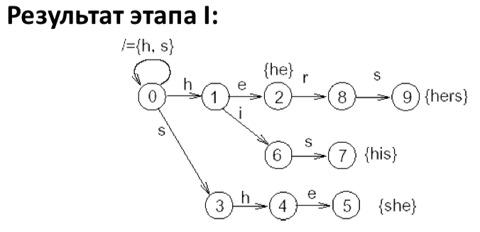

##### **Этап 2**
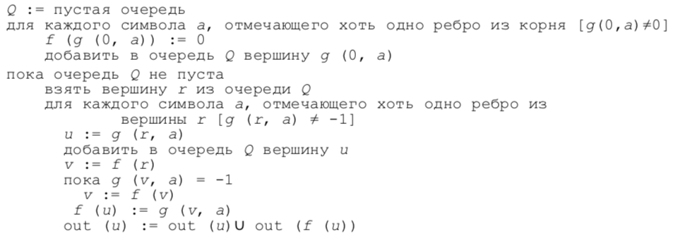

Функция неудачи и выходная функция вычисляются для всех вершин в порядке обхода в ширину.
    
    Когда мы работаем с вершиной, все вершины, находящиеся ближе, чем она, к корню (в т. ч. все те, метки которых короче, чем метка данной), уже обработаны.

* Рассмотрим узлы r и u = g (r, a), т. е. r - родитель u, и L (u) = L (r) a.
Теперь нужно, чтобы f (u) указывало на ту вершину, метка которой является самым длинным суффиксом L (u), являющимся также началом некоторого шаблона из множества P.
* Эта вершина ищется путем просматривания вершин, метки которых являются все более и более короткими суффиксами L (r), пока не находится вершина v, для которой g (v, a) определено; тогда g (v, a) и присваивается f (u).
* v и g (v, a) могут быть корнем.

Теперь разберемся с out (u) := out (u) ∪ out (f (u)).

    Это делается потому, что все шаблоны, распознаваемые при переходе в состояние f (u) (и только они) являются надлежащими суффиксами L (u) и должны быть отслежены при переходе в состояние u.

##### **Выполнение этапа 2 за время О(n):**
* Обход в ширину сам по себе занимает время пропорциональное размеру дерева, т. е. O(n).

##### Сколько же времени требуется на переходы по функции f в самом внутреннем цикле?
* Рассмотрим вершины u1, ..., ul, проходимые при введении в бор шаблона a1, ..., al, и глубины вершин, на которые указывают их функции неудачи, обозначенные df(u1), ..., df(ul).
* При этом df(ui+1) ≤ df(ui) + 1. Это значит, что значения df могут увеличиваться не более l раз за весь путь. С другой стороны каждое выполнение v := f (v) уменьшает значение df(u) как минимум на 1. Итого при просчете функций f для вершин шаблона длины l совершается не более l переходов. Для всех вершин будет совершено не более n переходов.

##### А много ли времени нужно на выполнение out (u) := out (u) ∪ out (f (u))?
* Нет: множества обнаруживаемых шаблонов можно хранить в виде связных списков, так что операция объединения выполняется за константное время.
(Все шаблоны в out (f (u)) короче, чем L (u), которая (возможно) является единственным членом out (u) перед объединением)

#### Реализация алгоритма:
```python
class AhoNode:
    def __init__(self):
        self.goto = {}
        self.out = []
        self.fail = None

def aho_create_forest(patterns):
    root = AhoNode()
    for path in patterns:
        node = root
        for symbol in path:
            node = node.goto.setdefault(symbol, AhoNode())
        node.out.append(path)
    return root

def aho_create_statemachine(patterns):
    root = aho_create_forest(patterns)
    queue = []
    for node in root.goto.values():
        queue.append(node)
        node.fail = root
    while len(queue) > 0:
        rnode = queue.pop(0)
        for key, unode in rnode.goto.items():
            queue.append(unode)
            fnode = rnode.fail
            while fnode is not None and key not in fnode.goto:
                fnode = fnode.fail
            unode.fail = fnode.goto[key] if fnode else root
            unode.out += unode.fail.out
    return root

def aho_find_all(text, sub):
    root = aho_create_statemachine([sub])
    node = root
    pos = []
    for i in range(len(text)):
        while node is not None and text[i] not in node.goto:
            node = node.fail
        if node is None:
            node = root
            continue
        node = node.goto[text[i]]
        for pattern in node.out:
            pos.append(i - len(pattern) + 1)
    return pos
```

#### Сложность
* |Σ|=σ - размер алфавита
* |text|=t — длина текста
* |pattern|=p — длина паттерна
* a — размер ответа(кол-во пар)
* m — суммарная длина всех паттернов

Вычислительная сложность работы алгоритма зависит от организации данных.
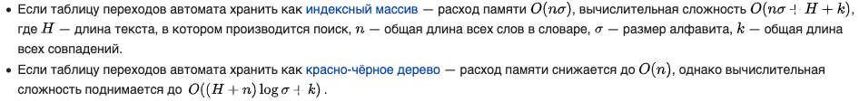

#### Сложность для данной реализации:

**Лучшее:** O(m * σ + t + a)

**Худшее:** O(m * σ + t + a)

**Среднее:** O(m * σ + t + a)

**Препроцессинг:** O(m)

**Память:** O(m σ)

## Функция для генерации данных и их сохранения
```python
def get_csv_table(filename, n=1000, faker=True):
    '''
    Записывает необходимые значения в таблицу для последующего анализа в Jupiter Notebook.

    :param filename: название файла
    :param n: количество записей в csvfile
    :param faker: включение генератора псевдореальных данных
    :return: None
    '''
    headers = "modDirectSearch,kmp,bmx,rabin_karp,aho_find_all,lib_find,textLen,subLen,index"
    with open(filename, 'w') as csvfile:
        writer = csv.DictWriter(csvfile, fieldnames=headers.split(','))
        writer.writeheader()

        for i in range(n):
            text = ""
            sub = ""

            if faker is True:
                fake = Faker()
                text = fake.text()
                sub = choice(text.split(' ')).split('\n')[0].split('.')[0]
            else:
                text = "".join(choice('abcdefghijklmnopqrstuvwxyz0123456789') for i in range(11))
                sub = "".join(choice('abcdefghijklmnopqrstuvwxyz0123456789') for i in range(3))
                while lib_find(text, sub) == -1:
                    sub = "".join(choice('abcdefghijklmnopqrstuvwxyz0123456789') for i in range(3))

            tk = modDirectSearch(text, sub)
            tk = kmp(text, sub)
            tk = bmx(text, sub)
            tk = rabin_karp(text, sub)
            tk = aho_find_all(text, sub)
            tk = lib_find(text, sub)

            global timedict
            timedict["textLen"] = len(text)
            timedict["subLen"] = len(sub)
            timedict['index'] = tk
            # print(timedict)
            writer.writerow(timedict)
    return
```

Для записи всех возможных вариантов поиска подстроки в строке использовалась библиотека random и для генерации данных - Faker.
Чтобы гарантировать наличие всех возможных вариантов, было сделано 1'000'000 записей за 6 часов работы.

## Анализ данных в Jupiter Notebook
В Jupiter Notebook были проанализированы данные и построены графики для каждого из алгоритмов.
Подробнее в analyse.ipynb

## Результаты анализа
### Сравнение алгоритмов с библиотечной функцией find
**График зависимости найденного индекса от времени выполнения**
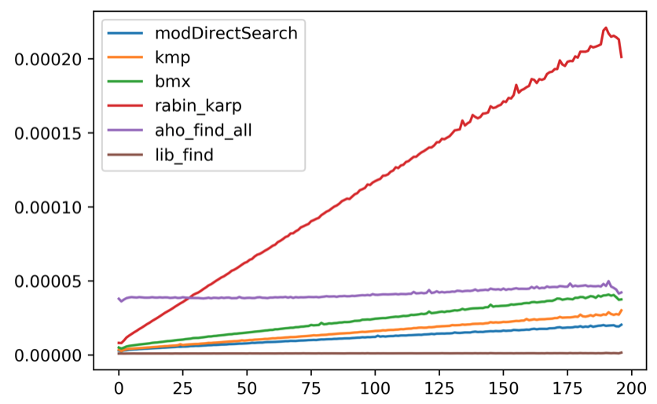

**График зависимости длины подстроки от времени выполнения**
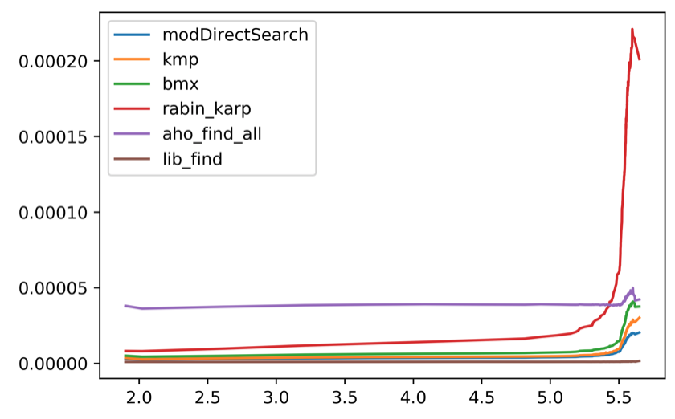


**График зависимости длины текста от времени выполнения**
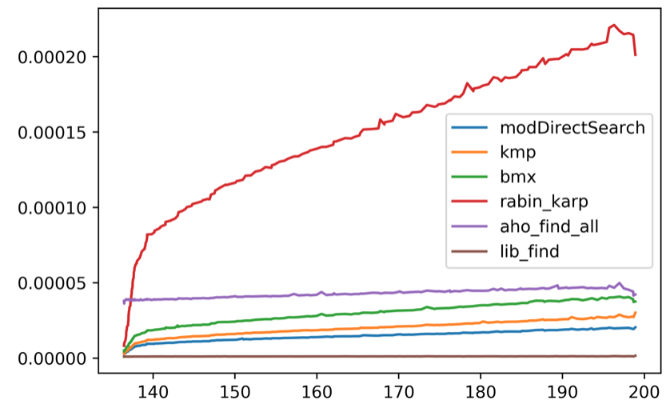


**Общий график**
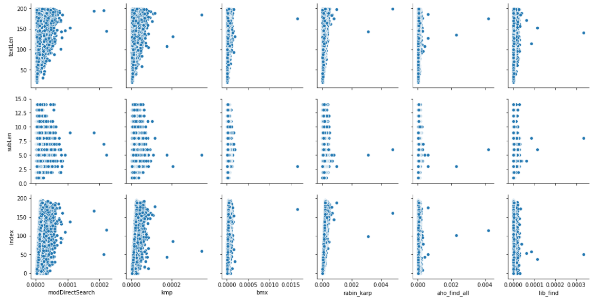


**Общий график с корреляцией данных**
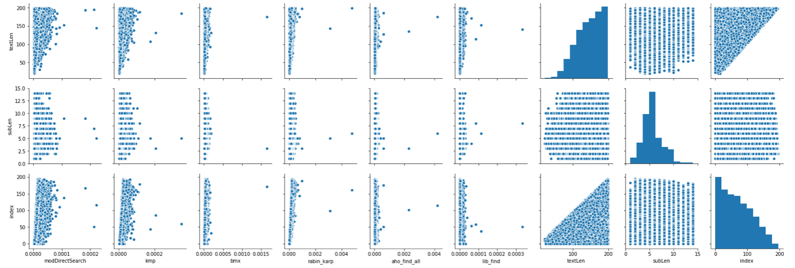


#### Вывод
1. Библиотечная функция find в Python отработала лучше всех, что и ожидалось.
2. А моя функция оказалась быстрее, используя перемещение индекса в зависимости от числа совпадений, ее можно использовать, когда индекс < 250.
3. На больших данных, когда индекс > 250, то следует использовать алгоритм Ахо-Корасик.
