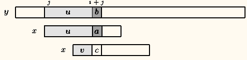
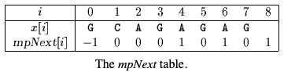
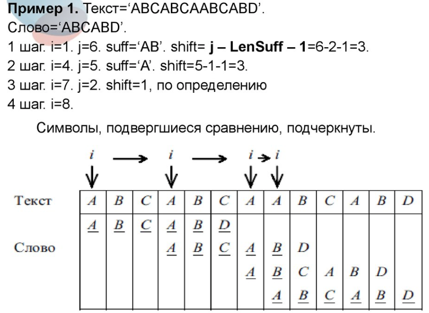
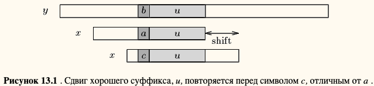
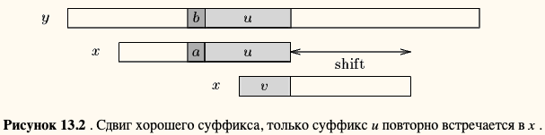
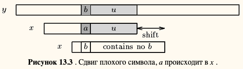
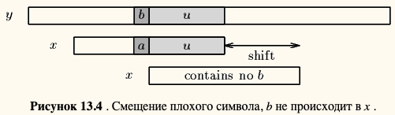
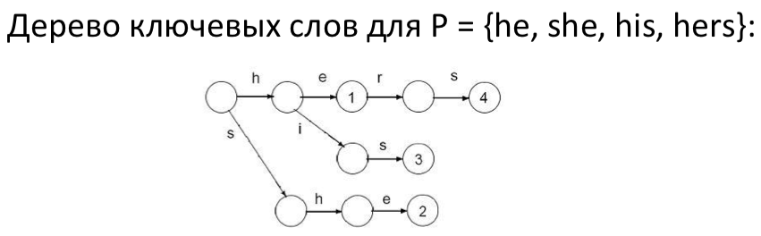
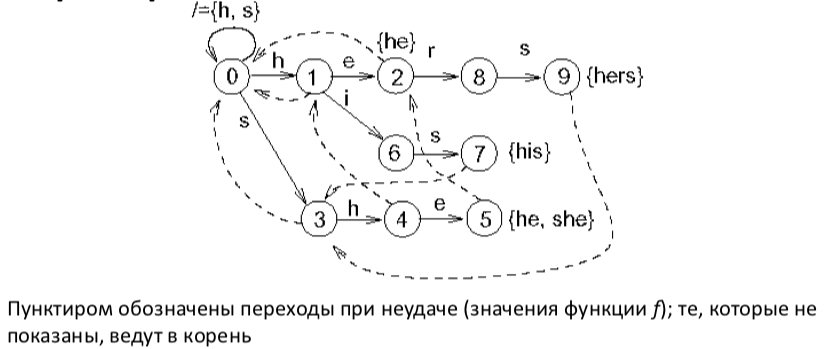

# Теоретическая часть 

## Условие задачи
Реализуйте и сравните 3-5 различных алгоритмов поиска подстроки в строке. Для каждого найдите условия, где он работает лучше всего.

## Подходы к решению задачи
* Формальная постановка задачи
* Алгоритм Кнута-Морриса-Пратта
* Алгоритм Бойера — Мура — Хорспула
* Мое решение (modDirectSearch)
* Алгоритм Рабина-Карпа
* Автоматный алгоритм алгоритм Ахо-Корасик

### Формальная постановка задачи

Канонический вариант задачи выглядит так: есть у нас строка A (текст). Необходимо проверить, есть ли в ней подстрока X (образец), и если есть, то где она начинается. То есть именно то, что делает функция find("X") в Python. 

-[x] Дополнительно к этому можно еще попросить найти все вхождения образца. Очевидно, что задача имеет смысл, когда X не длинее A.
-[x] В выкладках будем считать символы в строке с первой позиции. Код написан традиционно - отсчет от нуля.

Введем несколько понятий:
1. Строка — это последовательность символов, возможно пустая.
2. Символы, или буквы, принадлежат некоторому множеству, которое называют алфавитом.
3. Длина строки |A| — это, очевидно, количество символов в ней. 
4. Префикс строки A[..i] — это строка из i первых символов строки A. 
5. Суффикс строки A[j..] — это строка из |A|-j+1 последних символов. 
6. Подстроку из A будем обозначать как A[i..j], а A[i] — i-ый символ строки. 
7. Сентинел — некий уникальный символ, не встречающийся в алфавите. Его обозначают значком $ и дополняют допустимый алфавит таким символом.

### Алгоритм Кнута-Морриса-Пратта
    Алгоритм был разработан Д. Кнутом и В. Праттом и, независимо от них, Д. Моррисом. 
    Результаты своей работы они опубликовали совместно в 1977 году.
    
Метод КМП использует предобработку искомой строки, а именно: на ее основе создается префикс-функция.

Разработка алгоритма Морриса-Пратта следует из тщательного анализа алгоритма [Brute Force](http://www-igm.univ-mlv.fr/~lecroq/string/node3.html#SECTION0030), и особенно того, как последний использует информацию, собранную во время сканирования текста.

#### [Алгоритм Морриса-Пратта](http://www-igm.univ-mlv.fr/~lecroq/string/node7.html#SECTION0070)

Сдвиг в алгоритме МП (v граница u) | Фаза предварительной обработки
--- | ---
 |  |

#### Описание:
    Давайте более подробно рассмотрим алгоритм Brute Force. 
    Можно увеличить длину смен и одновременно запомнить некоторые части текста, которые соответствуют шаблону. 
    Это сохраняет сравнения между символами шаблона и символами текста и, следовательно, увеличивает скорость поиска.

    Рассмотрим попытку левой позиции j на y , то есть когда окно располагается на текстовом факторе y [ j .. j + m -1]. 
    Предположим, что первое несоответствие происходит между x [ i ] и y [ i + j ] с 0 < i < m. 
    Тогда x [0 .. i -1] = y [ j .. i + j -1] = u и a = x [ i ] ≠ y [ i + j ] = b.

    При смещении разумно ожидать, что префикс v шаблона соответствует некоторому суффиксу части u текста. 
    Длинный такой префикс v называется границей из U (это происходит на обоих концах U ). 
    Это вводит обозначение: пусть mpNext [ i ] будет длиной самой длинной границы x [0 .. i -1] для 0 < i  Leq m . 
    Затем, после сдвига, сравнения могут возобновиться между символами c = x [ mpNext [ i ]] и y [i + j ] = b, не пропуская x в y и не возвращаясь к тексту. 
    Значение mpNext [0] установлено в -1.

#### Пример:
Берем каждый возможный префикс строки и смотрим самое длинное совпадение начала с концом префикса (не учитывая тривиальное совпадение самого с собой). 
Вот пример для «ababcaba»:

префикс | p
--- | ---
a | 0
ab | 0
aba | 1
abab | 2
ababc | 0
ababca | 1
ababcab | 2
ababcaba | 3

#### Свойства:
1. Значения ограничены сверху своим номером, что следует прямо из определения — длина префикса должна быть больше префикс-функции. 
2. Уникальный символ точно так же делит строку на две части и ограничивает максимальное значение префикс-функции длиной меньшей из частей — потому что все, что длиннее, будет содержать уникальный, ничему другому не равный символ.

#### Алгоритм КМП на примере:

### Алгоритм Бойера — Мура — Хорспула
Алгоритм поиска подстроки в строке, упрощённый вариант алгоритма [Бойера — Мура](http://www-igm.univ-mlv.fr/~lecroq/string/node14.html#SECTION00140). 

#### Особенности:
    Сдвиг плохих символов, используемый в алгоритме Бойера-Мура, не очень эффективен для маленьких алфавитов. 
    Когда алфавит большой по сравнению с длиной шаблона, как это часто бывает в случае Таблица ASCII и обычный поиск, выполняемые под текстовым редактором, становятся очень полезными.
    Использование одного только дает очень эффективный алгоритм на практике. 
    Хорспул предложил использовать только сдвиг плохого символа самого правого символа окна для вычисления сдвигов в алгоритме Бойера-Мура.    

#### Алгоритм Бойера — Мура
Алгоритм Бойера-Мура считается наиболее эффективным алгоритмом сравнения строк в обычных приложениях. 
Упрощенная его версия или весь алгоритм часто реализуются в текстовых редакторах для команд «поиск» и «замена».

#### Описание:
Алгоритм сканирует символы шаблона справа налево, начиная с самого правого. 
В случае несоответствия (или полного соответствия всего шаблона) используются две предварительно вычисленные функции для смещения окна вправо. 
Эти две функции сдвига называются сдвигом хорошего суффикса (также называемым сдвигом соответствия и сдвигом плохих символов (также называемым сдвигом вхождения).

    Предположим, что происходит несоответствие между символом x [ i ] = a шаблона и символом y [ i + j ] = b текста во время попытки положения j.
    Тогда x [ i +1 .. m -1] = y [ i + j +1 .. j + m -1] = u и x [ i ] ≠ y [ i + j ]. 
    Сдвиг хорошего суффикса состоит в выравнивании сегмента y[ i + j +1 .. j + m -1] = x [ i +1 .. m -1] с самым правым вхождением в x , которому предшествует символ, отличный от x [ i ] ( см. рисунок 13.1 ).

    
    Если такого сегмента не существует, сдвиг состоит в выравнивании самого длинного суффикса v из y [ i + j +1 .. j + m -1] с совпадающим префиксом x ( см. Рисунок 13.2 ).

    Сдвиг плохого символа состоит в выравнивании текстового символа y [ i + j ] с его крайним правым вхождением в x [0 .. m -2]. ( см. рисунок 13.3 )
    

    Если y [ i + j ] не встречается в шаблоне x, вхождение x в y не может включать y [ i + j ], и левый конец окна выравнивается по символу сразу после y [ i + j ], а именно y [ i + j + 1] ( см. рисунок 13.4 ).
    

Cмещение плохого символа может быть отрицательным, поэтому для смещения окна алгоритм Бойера-Мура применяет максимум между сдвигом хорошего суффикса и сдвигом плохого символа.

#### Отличие БМХ и БМ
Модификация алгоритма Бойера-Мура (БМХ) справляется со случайными текстами лучше, чем сам исходный алгоритм. 
Но в отличии от исходного алгоритма, здесь не требуется никаких сложных вычислений — строится только таблица смещений, что не так сложно для реализации.

### Мое решение (modDirectSearch)
Данный алгоритм - это модификация алгоритма КМП, вместо префикс функции используется сумма совпадающих букв подстроки с подтекстом, что позволяет при несовпадении сдвигать итератор на эту сумму + 1.

    Смещение зависит от количества совпадающих символов во время итераций по тексту.

### Алгоритм Рабина-Карпа
Это алгоритм поиска строки, который ищет шаблон, то есть подстроку, в тексте, используя хеширование.
 
    Он был разработан в 1987 году Майклом Рабином и Ричардом Карпом.

#### Описание
Алгоритм редко используется для поиска одиночного шаблона, но имеет значительную теоретическую важность и очень эффективен в поиске совпадений множественных шаблонов одинаковой длины. Для текста длины n и шаблона длины m его среднее и лучшее время исполнения равно O(n) при правильном выборе хеш-функции, но в худшем случае он имеет эффективность O(nm), что является одной из причин того, почему он не слишком широко используется. Для приложений, в которых допустимы ложные срабатывания при поиске, то есть, когда некоторые из найденных вхождений шаблона на самом деле могут не соответствовать шаблону, алгоритм Рабина — Карпа работает за гарантированное время O(n) и при подходящем выборе рандомизированной хеш-функции вероятность ошибки можно сделать очень малой. Также алгоритм имеет уникальную особенность находить любую из заданных k строк одинаковой длины в среднем (при правильном выборе хеш-функции) за время O(n) независимо от размера k.

    Одно из простейших практических применений алгоритма Рабина — Карпа состоит в определении плагиата.

#### Использование хеширования для поиска подстрок сдвигом
Хеширование обеспечивает простой метод, позволяющий избежать квадратичного числа сравнений символов в большинстве практических ситуаций. Вместо того, чтобы проверять в каждой позиции текста, имеет ли место шаблон, представляется более эффективным проверять только то, выглядит ли содержимое окна как шаблон. Чтобы проверить сходство между этими двумя словами, используется функция хеширования.

Функции хеширования должна иметь следующие свойства:
1. эффективно вычисляемый;
2. очень разборчивы для строк;
3. хеш ( y [ j +1 .. j + m ]) должен быть легко вычисляемым из хеша ( y [ j .. j + m -1]) и y [ j + m ]:
    * hash ( y [ j +1 .. j + m ]) = перефразировка ( y [ j ], y [ j + m ], хеш ( y [ j ..j + m -1]).

#### Пример алгоритма (исходного кода приложения):
     1 function RabinKarp(string s[1..n], string sub[1..m])
     2     hsub := hash(sub[1..m])
     3     hs := hash(s[1..m])
     4     for i from 1 to (n-m+1)
     5         if hs = hsub
     6             if s[i..i+m-1] = sub
     7                 return i
     8         hs := hash(s[i+1..i+m])
     9     return not found

Строки 2, 3, и 6 затрачивают для исполнения время O(m) каждая. Однако строки 2 и 3 исполняются только один раз, а строка 6 выполняется только когда хеш-значения совпадают, что происходит нечасто. Строка 5 выполняется n раз, но всегда требует постоянного времени.

#### [Проблемы хеширования](https://ru.wikipedia.org/wiki/%D0%90%D0%BB%D0%B3%D0%BE%D1%80%D0%B8%D1%82%D0%BC_%D0%A0%D0%B0%D0%B1%D0%B8%D0%BD%D0%B0_%E2%80%94_%D0%9A%D0%B0%D1%80%D0%BF%D0%B0)
Однако существуют две проблемы, связанные с этим.
* Cуществует очень много различных строк, между двумя различными строками может произойти коллизия — совпадение их хешей.

>В таких случаях необходимо посимвольно проверять совпадение самих подстрок, что занимает достаточно много времени, если данные подстроки имеют большую длину (эту проверку делать не нужно, если ваше приложение допускает ложные срабатывания). При использовании достаточно хороших хеш-функций (смотрите далее) коллизии случаются крайне редко, и в результате среднее время поиска оказывается невелико.

* Вторая проблема заключается в пересчитывании хеша. При наивном пересчёте хеш-значения подстроки s[i+1..i+m] затрачивается время O( m ), и, так как это делается в каждом цикле, алгоритм будет затрачивать время O( m n ), то есть такое же, какое тратят и наиболее простые алгоритмы.

>Метод решения данной проблемы состоит в предположении того, что переменная hs уже содержит хеш-значение подстроки s[i..i+m-1]. Если использовать его для подсчёта следующего хеш-значения за постоянное время, тогда проблема будет решена.

##### Инструмент для решения 2 проблемы:
Это достигается использованием так называемого кольцевого хеша. Самым простым примером кольцевого хеша является добавление значений каждого следующего символа в подстроке и последующее использование данной формулы для подсчёта каждого следующего хеш-значения за фиксированное время:

    s[i+1..i+m] = s[i..i+m-1] - s[i] + s[i+m]

Такая формула не даёт никаких гарантий нечастого возникновения коллизий, и действительно несложно убедиться, что в большинстве приложений при её использовании выражение в 6 строке будет выполняться чаще, чем при использовании других, более «умных» кольцевых хеш-функций.

Заметим, что если мы очень неудачливы или имеем очень плохую хеш-функцию, например, такую, как постоянную функцию (hash=const), строка 6 с высокой вероятностью будет выполняться n раз, то есть при каждой итерации цикла. Так как она затрачивает время O( m ), сам алгоритм будет требовать время O( m n ).

### Автоматный алгоритм Ахо-Корасик
#### Описание
Алгоритм Ахо-Корасик (АК) (Aho-Corasick algorithm) (AC) - классическое решение задачи точного сопоставления множеств.
    
    АК основан на структуре данных "дерево ключевых слов" (keyword tree).

Дерево ключевых слов (или "бор") (keyword tree, trie) для множества шаблонов P - это дерево с корнем K, такое что:
1. Каждое ребро e в K отмечено одним символом.
2. Всякие два ребра, исходящие из одной вершины, имеют разные метки. Определим метку вершины v как конкатенацию меток ребер, составляющих путь из корня в v, и обозначим ее L (v).
3. Для каждого шаблона Pi из множества P есть вершина v, такая что L (v) = Pi. 4. Метка каждой вершины-листа является шаблоном из множества P.

#### Построение бора
Начинаем с дерева из одной вершины (корня); добавляем шаблоны Pi один за другим:
* Следуем из корня по ребрам, отмеченным буквами из Pi, пока возможно.
* Если Pi заканчивается в v, сохраняем идентификатор Pi (например, i) в v.
* Если ребра, отмеченного очередной буквой Pi нет, то создаем новые ребра и вершины для всех оставшихся символов Pi.

    Это занимает, очевидно, O (|P1| + ... + |Pk|) = O (n) времени

#### Поиск строки в бору
* Начинаем в корне, идем по ребрам, отмеченным символами S, пока возможно.
* Если с последним символом S мы приходим в вершину с сохраненным идентификатором, то S - слово из словаря.
* Если в какой-то момент ребра, отмеченного нужным символом, не находится, то строки S в словаре нет.
Ясно, что это занимает O (|S|) времени. 

Таким образом, бор - это эффективный способ хранить словарь и искать в нем слова.

#### Пример дерева ключевых слов (бора)

#### Автомат АК
**Состояния:** узлы бора.

**Начальное состояние:** корень, обозначим его 0.

Действия автомата определяются тремя функциями, определенными для всех состояний:

* **Функция goto** g (s, a) указывает, в какое состояние переходить из данного состояния s при просмотре символа a.

    Если ребро (u, v) отмечено символом a, то g (u, a) = v;
    g (0, a) = 0 для всех символов a, которыми не отмечено ни одно ребро, выходящее из корня. 
        
        =>Автомат остается в корне, пока просматриваются побочные символы.
    
    При всех остальных аргументах g пусть выдает -1.

* **Функция неудачи** f (s) указывает, в какое состояние переходить при просмотре неподходящего символа.

    Рассмотрим метку вершины s и найдем самый длинный суффикс этой метки, такой, что с него начинается некоторый шаблон из множества P. 
    Тогда f (s) пусть указывает на вершину, метка которой - этот суффикс.

* **Выходная функция** out (s) выдает множество шаблонов, которые обнаруживаются при переходе в состояние s

#### Пример автомата АК

## Ссылки
### Алгоритм Кнута-Морриса-Пратта
1. [Университет итмо](https://neerc.ifmo.ru/wiki/index.php?title=%D0%90%D0%BB%D0%B3%D0%BE%D1%80%D0%B8%D1%82%D0%BC_%D0%9A%D0%BD%D1%83%D1%82%D0%B0-%D0%9C%D0%BE%D1%80%D1%80%D0%B8%D1%81%D0%B0-%D0%9F%D1%80%D0%B0%D1%82%D1%82%D0%B0)
2. [Morris-Pratt algorithm](http://www-igm.univ-mlv.fr/~lecroq/string/node7.html#SECTION0070)
3. [Хабр](https://habr.com/ru/post/191454/)

### Алгоритм Бойера — Мура — Хорспула
1. [Университет итмо](https://neerc.ifmo.ru/wiki/index.php?title=%D0%90%D0%BB%D0%B3%D0%BE%D1%80%D0%B8%D1%82%D0%BC_%D0%91%D0%BE%D0%B9%D0%B5%D1%80%D0%B0-%D0%9C%D1%83%D1%80%D0%B0)
2. [Horspool algorithm](http://www-igm.univ-mlv.fr/~lecroq/string/node18.html#SECTION00180)
3. [Упрощенный алгоритм Бойера-Мура](https://habr.com/ru/post/116725/)
4. [Алгоритм Бойера-Мура-Хорспула](https://www.youtube.com/watch?v=KIUHWMwavQg)
4. [Алгоритм Бойера-Мура-Хорспула В](https://ru.wikipedia.org/wiki/%D0%90%D0%BB%D0%B3%D0%BE%D1%80%D0%B8%D1%82%D0%BC_%D0%91%D0%BE%D0%B9%D0%B5%D1%80%D0%B0_%E2%80%94_%D0%9C%D1%83%D1%80%D0%B0_%E2%80%94_%D0%A5%D0%BE%D1%80%D1%81%D0%BF%D1%83%D0%BB%D0%B0)
4. [Алгоритм Бойера-Мураа В](https://ru.wikipedia.org/wiki/%D0%90%D0%BB%D0%B3%D0%BE%D1%80%D0%B8%D1%82%D0%BC_%D0%91%D0%BE%D0%B9%D0%B5%D1%80%D0%B0_%E2%80%94_%D0%9C%D1%83%D1%80%D0%B0)

### Алгоритм Рабина-Карпа
1. [Karp-Rabin algorithm](http://www-igm.univ-mlv.fr/~lecroq/string/node5.html#SECTION0050)
1. [Алгоритм Рабина — Карпа](https://ru.wikipedia.org/wiki/%D0%90%D0%BB%D0%B3%D0%BE%D1%80%D0%B8%D1%82%D0%BC_%D0%A0%D0%B0%D0%B1%D0%B8%D0%BD%D0%B0_%E2%80%94_%D0%9A%D0%B0%D1%80%D0%BF%D0%B0)

### Автоматный алгоритм алгоритм Ахо-Корасик
1. [Университет итмо](https://neerc.ifmo.ru/wiki/index.php?title=%D0%90%D0%BB%D0%B3%D0%BE%D1%80%D0%B8%D1%82%D0%BC_%D0%90%D1%85%D0%BE-%D0%9A%D0%BE%D1%80%D0%B0%D1%81%D0%B8%D0%BA)
2. [Research with an automaton](http://www-igm.univ-mlv.fr/~lecroq/string/node4.html#SECTION0040)

## Литература
* Кормен Т. Х., Лейзерсон Ч. Е., Ривест Р. Л., Штайн К. Алгоритмы: построение и анализ = Introduction to Algorithms / под ред. С. Н. Тригуба; пер. с англ. И. В. Красиков, Н. А. Орехов, В. Н. Романов. — 2-е изд. — М.: Вильямс, 2005. — 801 с. — ISBN 5-8459-0857-4.

